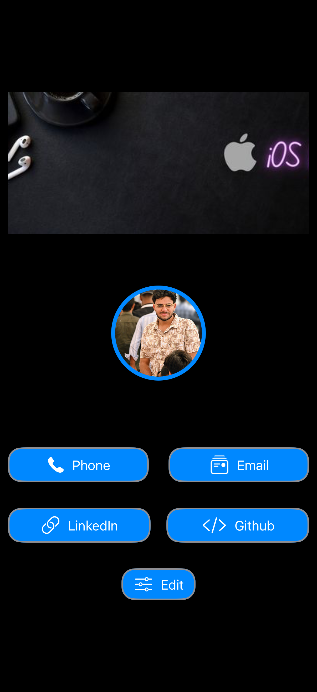
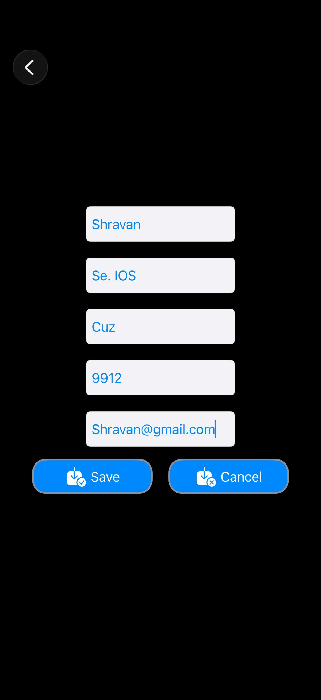
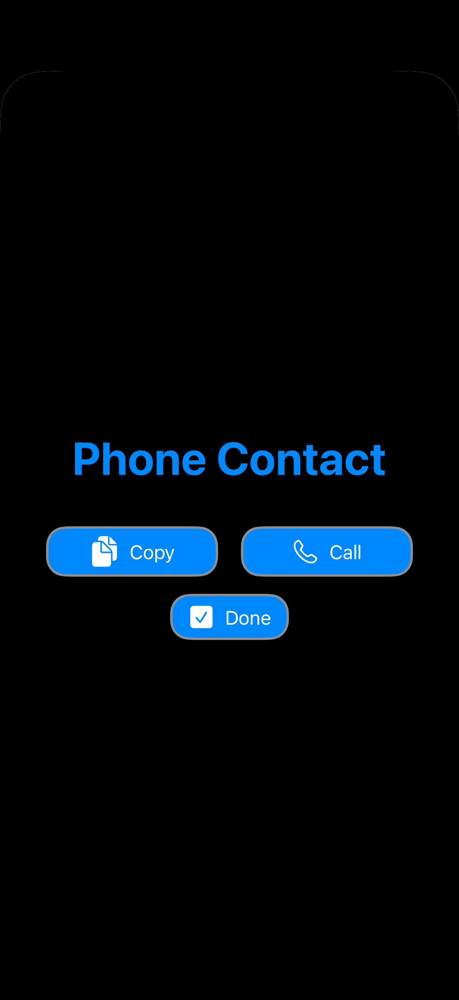

# 🪪 Personal Business Card App — iOS App
> App #1 of my iOS Development Journey | Built with Swift + UIKit | Zero Storyboards
 
## 📱 Overview
A fully programmatic iOS app to digitize your professional identity. View, interact with, and edit your card — all data persists via `UserDefaults`.
 
---
 
## 🖥️ Screenshots
 
| Card Screen | Edit Screen | Phone Modal |
|---|---|---|
|  |  |  |
 
---
 
## 🖥️ Screens
- **Main Card** — Profile photo, name, designation, action buttons (Phone, Email, LinkedIn, GitHub)
- **Phone / Email Modals** — Copy to clipboard + native call/mail via URL schemes
- **Edit Screen** — Update all card fields, saved to `UserDefaults`, card refreshes on return
## ⚙️ Features
| Feature | Detail |
|---|---|
| Circular profile photo | `cornerRadius` timed via `viewDidAppear` |
| Copy to clipboard | `UIPasteboard` + auto-dismiss alert |
| Call & email | `tel://`, `mailto://` URL schemes |
| Data persistence | `UserDefaults` read/write |
| Live card refresh | `viewWillAppear` reloads on every appear |
 
## 🛠️ Tech Stack
Swift · UIKit · Programmatic UI · `NSLayoutConstraint` · `UIStackView` · `UserDefaults` · `UIPasteboard` · URL Schemes · `UINavigationController` · Modal presentation
 
## 🧠 Concepts Practiced
`UIStackView` nesting · Programmatic Auto Layout · Modal present/dismiss · `UserDefaults` · URL schemes · `UIAlertController` · `viewWillAppear` refresh · `UIButton.Configuration` + SF Symbols
 
## 🚀 Getting Started
```bash
git clone https://github.com/vermagagan/BusinessCard-iOS.git
```
Open `BusinessCard.xcodeproj` in Xcode · Run on iOS 16+ · No dependencies.
 
## 👨‍💻 Author
**vermagagan** · Aspiring iOS Developer · Building in public
[](https://linkedin.com/in/vermagagan) [](https://github.com/vermagagan)
 
> *"Every pixel placed in code. This was the app that made Auto Layout finally click."*
